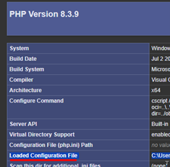
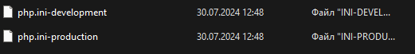
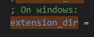
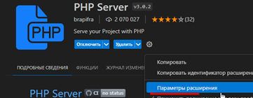
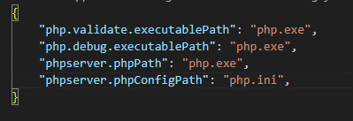

# Типы данных.
Выполнил студент [Волотовский Роман](https://github.com/Volotovskii/task_12) поток PHPPRO_22.

Разработан в качестве практического задания - <a href = "https://apps.skillfactory.ru/learning/course/course-v1:SkillFactory+PHPPRO+2022/block-v1:SkillFactory+PHPPRO+2022+type@sequential+block@8c64b7e02b224744841d726a78481384/block-v1:SkillFactory+PHPPRO+2022+type@vertical+block@20ebb0f4f7b54926bc1a6eb824de7287"> Модуль 12. Типы данных (12.6.1 Практика (HW-02)) </a>

## Используемые технологии

* HTML;

* CSS;

* php.


## Как открыть/запустить
Если используете VS code:
* Установить php ( и воможно придётся прописать путь в settings.json до php.exe ("php.validate.executablePath": "./php.exe") );
* Так же зайти в настройки PHP server и прописать в поле "Phpserver: PHP Path" - пулный путь до php.exe
* Установить PHP Server:
1) В init.php справа сверху нажать PHP server;
2) В init.php нажать правой кнопкой мишы в тексте и запустить php сервер.

Если при поднятии сервера и обработки модуля mbstring  пишется -
(Fatal error: Uncaught Error: Call to undefined function mb_convert_case() (любая другая функция)) 
### Способы решения:

1) Проверить php.ini: Проверяем, что он вообще есть, либо заходим в папку куда установили php или создаём файлик название.php и пишем в нём ```<?php phpinfo(); ?> ``` <br />
 <br />
В данной строке будет прописан путь к ini файлу, если его нету, то необходимо его создать и прописать путь.

Заходим в папку где лежит php если у нас нету ini файла то берём php.ini-development и меняем расширение на ini. (Можно через vs code) или просто поменять расширение. 
<br /> <br />

2) Так же нам необходимо подкорректировать ini файл – заходим в него: <br /><br />
Ищем строку extension_dir в ней прописываем полной путь до папки ext (можно попробовать оставить стандартное значение) (находится там же где php.exe)  
<br /> <br />
Далее находим extension=mbstring – раскомментируем строку сохраняем.

### Если не помогло:

1) Прописываем путь “PHP Server” заходим в настройки расширения: 
<br /> <br />
*	Phpserver: PHP Config Path – прописываем путь к ini файлу 
*	Phpserver: PHP Path – тут должен быть путь к исполняемому php.exe

2) Так же можно продублировать в файлике settings.json (ПУТИ УКАЗЫВАЕМ ПОЛНОСТЬЮ) 
<br /> <br />


